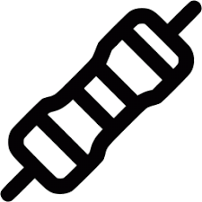
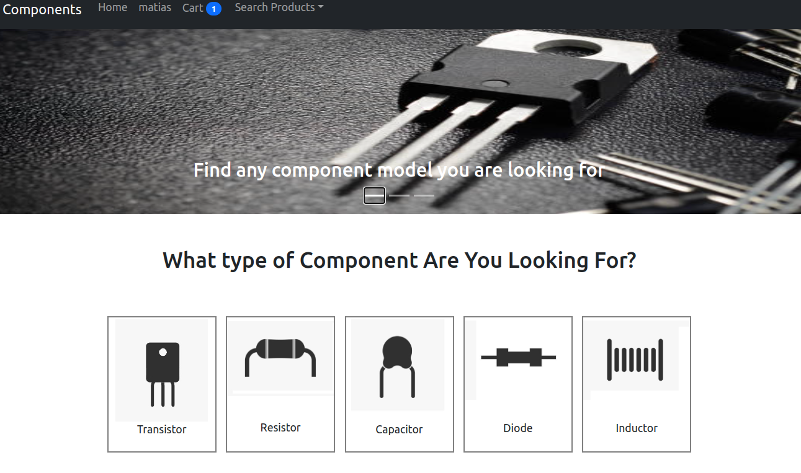

<!-- PROJECT LOGO -->
<br />

<div align="center">
  

  <h3 style="font-family: Roboto;" align="center">Electronic Components Ecommerce</h3>
</div>
<br />

<div align="center">
  
</div>

</div>

<!-- Description -->

## Description

The project is a full-stack e-commerce designed for purchasing electronic components.

The website integrates PayPal Sandbox for payment processing, and employs JSON Web Tokens for authentication.

<hr />

### 🔧 Built With

- 
- 
- 
- 
- 
- 

<hr />

### 💻Prerequisites

- [node](https://nodejs.org/en/)
- [docker-compose](https://docs.docker.com/get-docker/)

<hr />

### 🚀 Installation

1. Clone the repo
   ```sh
   git clone https://github.com/MatiasDallavia/Electronic_Components_Ecomerce.git
   ```
2. Navigate to the project directory

   ```sh
   cd Electronic_Components_Ecomerce
   ```

3. Create the node_modules

   ```sh
   (cd frontend/ && npm install)
   ```

4. Create an .env.dev file in root and add the following
   ```env
      #paypal
      #Add your paypal sandbox credentials here. Not doing doing so will make
      #the app not able to proccess payments, but all other features of the page will work fine
      CLIENT_ID=YOUR_CLIENT_ID
      SECRET=YOUR_SECRET_KEY


      #DJANGO
      DEBUG=1
      SECRET_KEY=foo
      DJANGO_ALLOWED_HOSTS=localhost 127.0.0.1 [::1]

      #POSTGRES
      DB_USER=postgres
      DB_PASSWORD=postgres
      DB_PORT=5432
      DB_NAME=electronic_components_db
      DB_HOST=db
      DATABASE=postgres

   ```
5. Build the containers
   ```sh
   docker-compose up -d --build
   ```
6. Go to [http://localhost:3000](http://localhost:3000)`

<hr>

### Running tests

```sh
docker exec -it backend pytest .
```

<p align="right">(<a href="#readme-top">back to top</a>)</p>
